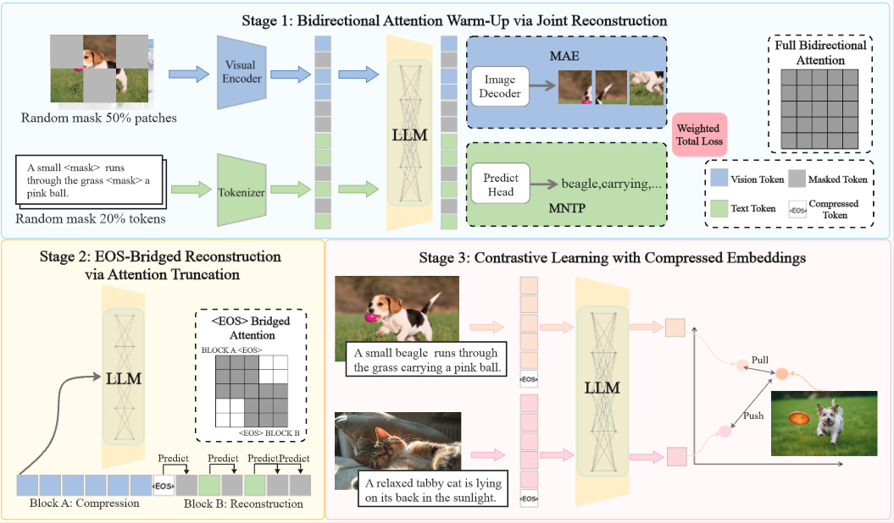
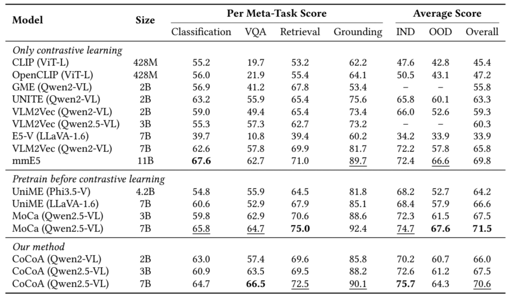

# CoCoA: Reconstructing Content with Collaborative Attention for Universal Multimodal Representation Learning
<div align="left"> 

[](https://arxiv.org/abs/2603.01471)
[](https://github.com/Fmajor77/CoCoA)
</div>

## Introduction
Multimodal embedding models, rooted in multimodal large language models (MLLMs), have yielded significant performance improvements across diverse tasks such as retrieval and classification. However, most existing approaches rely heavily on large-scale contrastive learning and offer limited exploration of how the architectural and training paradigms of MLLMs affect embedding quality.
While effective for generation, the causal attention and next-token prediction paradigm of MLLMs does not explicitly encourage the formation of globally compact representations, limiting their effectiveness as multimodal embedding backbones. To address this, we propose CoCoA, a Content reconstruction pre-training paradigm based on Collaborative Attention for universal multimodal representation learning. Specifically, we restructure the attention flow and introduce an EOS-based reconstruction task, encouraging the model to reconstruct input from the corresponding <EOS> embeddings. This drives the multimodal model to compress the semantic information of the input into the <EOS> token, laying the foundations for subsequent contrastive learning.
Extensive experiments on MMEB-V1 demonstrate that CoCoA built upon Qwen2-VL and Qwen2.5-VL significantly improves embedding quality. Results validate that content reconstruction serves as an effective strategy to maximize the value of existing data, enabling multimodal embedding models to generate compact and informative representations, raising their performance ceiling. 

## Architecture
The overall architecture is shown as follows:
<div style="display: flex;">
  
</div>

## Performance
<p align="center" style="width: 70%; height: auto;">
    
<p>

## Environmental Requirements
The packages we use during training and inference can be found in requirements.txt
``` bash
pip install -r requirements.txt
```

## Training 
``` bash
./scripts/cl_train.sh
```
## Inference 
``` bash
./scripts/eval.sh
```

## Acknowledgements
This project is based on the work of VLM2Vec, MoCa, Qwen2-VL, Qwen2.5-VL.  


## Citation
```
@misc{chen2026reconstructingcontentcollaborativeattention,
      title={Reconstructing Content with Collaborative Attention for Universal Multimodal Representation Learning}, 
      author={Jiahan Chen and Da Li and Hengran Zhang and Yinqiong Cai and Lixin Su and Jiafeng Guo and Daiting Shi and Dawei Yin and Keping Bi},
      year={2026},
      eprint={2603.01471},
      archivePrefix={arXiv},
      primaryClass={cs.IR},
      url={https://arxiv.org/abs/2603.01471}, 
}
```

